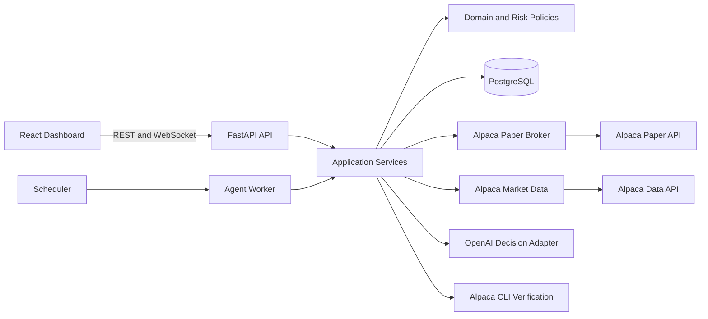
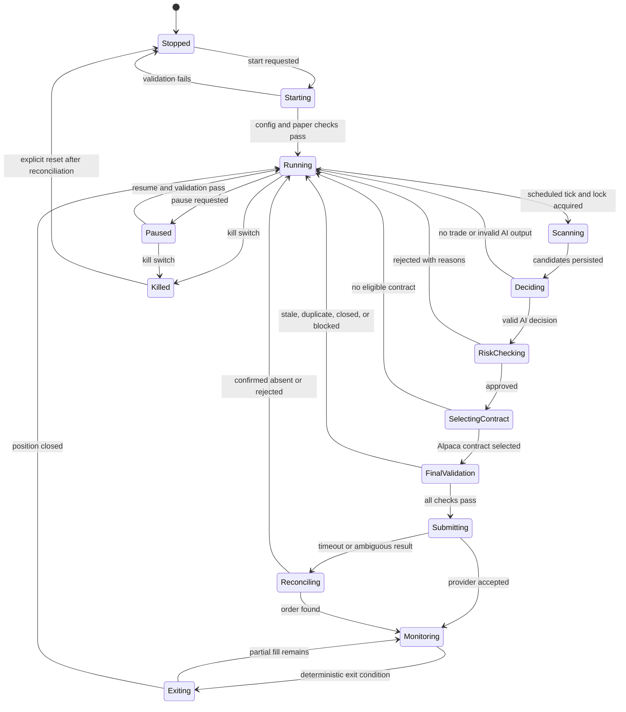

# SignalForge Architecture

Status: Baseline implemented; deployment limitations are documented in the README  
Scope: Architecture, safety invariants, and implementation boundaries  
Target: Alpaca paper trading, long calls and long puts  
Runtime: Python 3.12+, PostgreSQL, FastAPI, React/TypeScript

## 1. Goals and Non-Goals

SignalForge is an autonomous options research and paper-execution platform. It continuously collects market data, detects technical opportunities, obtains a schema-validated LLM recommendation, applies deterministic risk controls, selects a real Alpaca option contract, submits a paper order, manages the resulting position, and records a complete audit trail.

The first release optimizes for auditability, safety, and demo reliability rather than strategy complexity or maximum trading frequency.

### Goals

- Run an autonomous scan-to-exit trading loop.
- Use only Alpaca paper trading and fail closed on ambiguous configuration.
- Keep the LLM advisory; deterministic code has final execution authority.
- Make every decision traceable through a correlation ID and persisted lifecycle.
- Recover safely after process restarts and tolerate transient provider failures.
- Present decisions, risk results, positions, P&L, and controls in a polished dashboard.
- Use the official Alpaca CLI as an independently verifiable hackathon integration.

### Initial non-goals

- Live-money trading or support for Alpaca live endpoints.
- Naked short options, multi-leg strategies, assignment management, or exercise automation.
- High-frequency trading or sub-minute latency targets.
- An LLM that invents symbols, contracts, prices, quantities, or order parameters.
- Multi-tenant brokerage accounts in the first release.
- Claiming profitability without out-of-sample evaluation and realistic execution costs.

## 2. Safety Invariants

These invariants are architectural constraints, not configurable preferences.

1. The broker implementation accepts only an allowlisted paper base URL: `https://paper-api.alpaca.markets`.
2. Configuration containing a live URL, `ALPACA_LIVE_TRADE=true`, or an unknown trading URL prevents application startup.
3. Only `BUY_CALL`, `BUY_PUT`, and closing sells for owned quantities are supported.
4. The initial order path cannot open a short option position.
5. Order submission is disabled unless both paper mode and an explicit execution switch are active.
6. The risk engine and final validator cannot be bypassed by API routes, workers, or LLM output.
7. A kill switch blocks new entries and initiates the configured paper-only cancellation/exit policy.
8. Every order uses an idempotent client order ID derived from the candidate ID and attempt number.
9. A stale quote, closed market, invalid model output, provider ambiguity, or missing audit persistence rejects entry.
10. Secrets remain server-side, are redacted from logs, and are never returned by an API.
11. Automated tests use fake brokers and cannot resolve or call external trading endpoints.

## 3. Architecture Overview

The recommended design is a modular monolith with separately runnable API and worker processes. This provides clean boundaries and production-style deployment while avoiding distributed-system complexity during a hackathon. Modules communicate through typed service interfaces and PostgreSQL records, not direct cross-layer imports.



### Layers

- **Domain:** provider-independent entities, value objects, state transitions, and risk rules.
- **Application:** use cases that orchestrate scans, decisions, validation, execution, reconciliation, and exits.
- **Infrastructure:** Alpaca, OpenAI, PostgreSQL, CLI, clock, and logging adapters.
- **Delivery:** FastAPI routes/WebSockets, React UI, scheduler, and command-line administration.

### Process model

- `api`: serves REST/WebSocket traffic and read-oriented dashboard queries.
- `worker`: executes agent cycles, position monitoring, order reconciliation, and exit evaluation.
- `postgres`: source of truth for configuration, lifecycle state, and audit data.
- `frontend`: static React build served by a web server or the API in development.

For the first milestone, one worker uses PostgreSQL advisory locking to guarantee a single active agent. The design can later move jobs to a durable queue without changing domain interfaces.

## 4. Repository Structure

```text
signalforge/
|-- backend/
|   |-- alembic/
|   |-- app/
|   |   |-- api/
|   |   |   |-- dependencies.py
|   |   |   |-- errors.py
|   |   |   |-- routes/
|   |   |   |-- websocket.py
|   |   |-- application/
|   |   |   |-- agent_service.py
|   |   |   |-- execution_service.py
|   |   |   |-- monitoring_service.py
|   |   |   |-- portfolio_service.py
|   |   |   |-- reconciliation_service.py
|   |   |-- core/
|   |   |   |-- config.py
|   |   |   |-- errors.py
|   |   |   |-- logging.py
|   |   |   |-- security.py
|   |   |-- domain/
|   |   |   |-- entities.py
|   |   |   |-- enums.py
|   |   |   |-- events.py
|   |   |   |-- interfaces.py
|   |   |   |-- value_objects.py
|   |   |-- infrastructure/
|   |   |   |-- alpaca/
|   |   |   |-- database/
|   |   |   |-- openai/
|   |   |   |-- repositories/
|   |   |-- services/
|   |   |   |-- indicators.py
|   |   |   |-- market_data.py
|   |   |   |-- opportunity.py
|   |   |   |-- option_selector.py
|   |   |   |-- risk_engine.py
|   |   |   |-- exit_engine.py
|   |   |-- workers/
|   |   |   |-- scheduler.py
|   |   |   |-- tasks.py
|   |   |-- main.py
|   |-- tests/
|   |   |-- contract/
|   |   |-- integration/
|   |   |-- unit/
|   |   |-- conftest.py
|   |-- alembic.ini
|   |-- pyproject.toml
|-- frontend/
|   |-- src/
|   |   |-- components/
|   |   |-- features/
|   |   |   |-- agent/
|   |   |   |-- configuration/
|   |   |   |-- dashboard/
|   |   |   |-- history/
|   |   |   |-- positions/
|   |   |-- hooks/
|   |   |-- lib/
|   |   |-- pages/
|   |   |-- services/
|   |   |-- types/
|   |   |-- App.tsx
|   |   |-- main.tsx
|   |-- package.json
|   |-- vite.config.ts
|-- docs/
|   |-- ARCHITECTURE.md
|   |-- OPERATIONS.md
|   |-- DEMO.md
|-- scripts/
|   |-- verify_alpaca_cli.ps1
|   |-- seed_demo_data.py
|-- .env.example
|-- docker-compose.yml
|-- Makefile
|-- README.md
```

Feature folders in the frontend own their components, queries, and view models. Backend route handlers call application services and contain no trading logic.

## 5. Domain Model

### Core entities

| Entity | Identity | Responsibility |
| --- | --- | --- |
| `AgentRun` | UUID | One autonomous cycle with start/end status and summary counters |
| `MarketSnapshot` | UUID | Immutable normalized market inputs and freshness metadata |
| `TradeCandidate` | UUID | Detected opportunity and lifecycle correlation root |
| `AIDecision` | UUID | Validated LLM recommendation, model metadata, and rationale |
| `RiskDecision` | UUID | Immutable list of per-rule results and final verdict |
| `OptionContractSnapshot` | UUID | Alpaca contract plus quote, Greeks, liquidity, and observed time |
| `Order` | UUID | Local order record linked to provider order/client order IDs |
| `Fill` | UUID | Immutable provider fill event |
| `Position` | UUID | Reconciled view of an owned option position and exit policy |
| `PortfolioSnapshot` | UUID | Equity, cash, buying power, exposure, and P&L at a point in time |
| `JournalEvent` | UUID | Append-only human-readable and machine-readable audit event |
| `AgentConfiguration` | UUID/version | Versioned strategy and risk settings active for a run |

### Important value objects

- `Money(amount: Decimal, currency: USD)`
- `Percentage(value: Decimal)`
- `Quote(bid, ask, bid_size, ask_size, observed_at, source)`
- `ExpiryWindow(min_dte, max_dte)`
- `IndicatorSet(rsi, ema_fast, ema_slow, atr, realized_volatility, momentum, volume_ratio)`
- `RiskRuleResult(rule, passed, observed, threshold, reason)`
- `ExecutionIntent(contract_symbol, side, quantity, order_type, limit_price)`
- `CorrelationContext(correlation_id, agent_run_id, candidate_id)`

Money and quantities use `Decimal`, not binary floating point. All timestamps are timezone-aware UTC; exchange-session checks use the Alpaca market clock/calendar.

### Enums

- `AgentStatus`: `STOPPED`, `STARTING`, `RUNNING`, `PAUSED`, `KILLED`, `DEGRADED`
- `CandidateStatus`: `DISCOVERED`, `AI_PENDING`, `AI_REJECTED`, `RISK_PENDING`, `RISK_REJECTED`, `CONTRACT_PENDING`, `VALIDATION_PENDING`, `APPROVED`, `SUBMITTING`, `SUBMITTED`, `MONITORING`, `EXITING`, `CLOSED`, `FAILED`
- `TradeAction`: `BUY_CALL`, `BUY_PUT`, `NO_TRADE`
- `OrderStatus`: provider-aligned states plus `UNKNOWN_RECONCILIATION_REQUIRED`
- `ExitReason`: `STOP_LOSS`, `TAKE_PROFIT`, `SIGNAL_REVERSAL`, `MAX_HOLD`, `EXPIRY`, `KILL_SWITCH`, `RISK_EVENT`, `MANUAL_PAPER_EXIT`

### Provider interfaces

```python
class BrokerClient(Protocol):
    async def get_account(self) -> AccountSnapshot: ...
    async def get_market_clock(self) -> MarketClock: ...
    async def get_positions(self) -> list[BrokerPosition]: ...
    async def get_orders(self, status: OrderQueryStatus) -> list[BrokerOrder]: ...
    async def get_option_contracts(self, query: ContractQuery) -> list[OptionContract]: ...
    async def submit_order(self, intent: ExecutionIntent) -> BrokerOrder: ...
    async def cancel_order(self, provider_order_id: str) -> BrokerOrder: ...
    async def close_owned_position(self, symbol: str, quantity: int) -> BrokerOrder: ...

class MarketDataProvider(Protocol):
    async def get_bars(self, request: BarsRequest) -> list[Bar]: ...
    async def get_stock_snapshots(self, symbols: list[str]) -> dict[str, StockSnapshot]: ...
    async def get_option_snapshots(self, symbols: list[str]) -> dict[str, OptionSnapshot]: ...

class DecisionEngine(Protocol):
    async def recommend(self, context: DecisionContext) -> AIDecision: ...
```

The application depends on these protocols. `AlpacaPaperBroker`, `AlpacaMarketDataProvider`, and `OpenAIDecisionEngine` are infrastructure adapters and are replaced by strict fakes in tests.

## 6. Database Schema

PostgreSQL is the authoritative store. JSONB retains provider snapshots and detailed rule output while typed columns support reliable filtering and analytics.

### Tables

| Table | Key columns and constraints |
| --- | --- |
| `agent_configurations` | `id`, `version UNIQUE`, `active`, `strategy JSONB`, `risk JSONB`, `created_at`; one active row enforced |
| `agent_runs` | `id`, `configuration_id`, `status`, `trigger`, `started_at`, `completed_at`, counters, `error_code` |
| `market_snapshots` | `id`, `run_id`, `symbol`, `observed_at`, `data_timestamp`, OHLCV/quote JSONB, indicators JSONB; index `(symbol, observed_at DESC)` |
| `trade_candidates` | `id`, `run_id`, `correlation_id UNIQUE`, `symbol`, `status`, direction, detector score, `snapshot_id`, timestamps, version counter |
| `ai_decisions` | `id`, `candidate_id UNIQUE`, action, confidence, expiry bounds, moneyness, thesis, risks JSONB, model, request/response IDs, schema version, latency, `created_at` |
| `risk_decisions` | `id`, `candidate_id`, verdict, rule_results JSONB, equity basis, approved premium/quantity, configuration version, `created_at`; unique per evaluation version |
| `option_contract_snapshots` | `id`, `candidate_id`, Alpaca symbol, type, strike, expiry, quote fields, Greeks, volume, open interest, `observed_at`, selection score, selected |
| `orders` | `id`, `candidate_id`, `position_id`, `client_order_id UNIQUE`, provider order ID `UNIQUE`, intent, status, quantity, prices, submitted/updated timestamps, provider payload JSONB |
| `fills` | `id`, `order_id`, provider activity/fill ID `UNIQUE`, quantity, price, `filled_at`, payload JSONB |
| `positions` | `id`, contract symbol, underlying, status, quantity, entry price/time, stop/target, opened/closed timestamps, realized P&L, `version`; at most one active position per contract |
| `portfolio_snapshots` | `id`, `observed_at`, equity, cash, options buying power, market value, daily/total P&L, exposure, provider payload JSONB |
| `journal_events` | `id`, `correlation_id`, `run_id`, `candidate_id`, `event_type`, severity, message, details JSONB, `created_at`; append-only |
| `system_controls` | singleton `id`, desired agent state, kill switch, changed at/by, reason |
| `loss_streaks` | singleton/day key, trading date, consecutive losses, realized daily P&L, cooldown until |

### Lifecycle and consistency

- Candidate state changes and journal events commit in one transaction.
- Before provider submission, an `orders` row is inserted with a unique client order ID and `SUBMITTING` status.
- After an uncertain timeout, the order is not blindly retried. Reconciliation queries Alpaca by client order ID first.
- Provider orders, fills, and positions are periodically reconciled into local records.
- Optimistic version columns prevent concurrent monitor updates from applying duplicate exits.
- Journal records are append-only at the application permission level.
- Retain raw provider payloads with secret/header redaction to support debugging.

## 7. Agent State Machine



The global agent state and each candidate lifecycle are persisted separately. A process restart reads desired state, reconciles all `SUBMITTING`, `SUBMITTED`, `MONITORING`, and `EXITING` records, then resumes scheduling.

## 8. Trading Data Flow

1. Scheduler acquires the single-worker advisory lock and creates an `AgentRun`.
2. Startup guard validates paper-only configuration, kill switch, market session, and provider health.
3. Market Data Service retrieves bars and stock snapshots for the configured universe with bounded concurrency and retries.
4. Indicator Engine normalizes bars and calculates RSI, EMA trend, ATR, volatility, momentum, and relative volume.
5. Opportunity Detector applies deterministic minimum criteria and persists candidates plus source snapshots.
6. LLM Decision Engine receives only normalized, timestamped context and returns a strict Pydantic-validated recommendation.
7. Preliminary Risk Engine evaluates portfolio, model confidence, loss limits, cooldown, duplication, and exposure.
8. Option Selector queries Alpaca contracts and snapshots, filters invalid contracts, and deterministically scores eligible contracts.
9. Final Validator refreshes the selected quote, market clock, account, open orders, and positions; it reruns price-sensitive risk rules.
10. Execution Service persists an idempotent intent and submits a limit order to the Alpaca paper endpoint.
11. Reconciliation updates order/fill/position state from Alpaca until terminal.
12. Position Monitor evaluates deterministic exits and routes approved closing intents through the same validation and audit path.
13. Portfolio Service records snapshots and realized/unrealized P&L.
14. WebSocket publisher emits sanitized domain events after database commit.

## 9. Alpaca Integration Boundary

### Separate adapters

- `AlpacaMarketDataProvider`: stock bars/snapshots and option snapshots.
- `AlpacaPaperBroker`: account, clock, contract master, orders, positions, and closing actions.
- `AlpacaCliVerifier`: runs read-only `alpaca account get --quiet` and records connectivity evidence for the dashboard/demo.

The official option snapshots endpoint supplies latest trades, quotes, and Greeks for Alpaca contract symbols. The official CLI emits structured JSON for API commands and supports paper authentication. Endpoint paths and payload models will be contract-tested against current official documentation before implementing each adapter.

### Boundary policies

- Validate the trading hostname at settings construction and again inside the broker adapter.
- Do not expose a configurable live hostname in `.env.example`.
- Send explicit connect/read/write timeouts and bounded retry policies.
- Retry safe GETs for network failures, `429`, and selected `5xx` responses with exponential backoff and jitter.
- Never automatically retry an order POST without client-order-ID reconciliation.
- Capture response/request identifiers when provided, but strip authentication headers.
- Rate-limit and batch market-data requests; cap concurrent calls.
- Normalize provider models at the adapter boundary so domain code never handles raw dictionaries.
- Reject contracts not returned by Alpaca or marked inactive/non-tradable.
- Use limit orders for option entries; calculate the limit from a fresh quote and bounded price policy.

## 10. LLM Integration Boundary

The OpenAI adapter uses the Responses API with Structured Outputs. The expected object is represented by a Pydantic model and versioned JSON Schema.

```python
class AITradeRecommendation(BaseModel):
    model_config = ConfigDict(extra="forbid")

    symbol: str
    decision: Literal["BUY_CALL", "BUY_PUT", "NO_TRADE"]
    confidence: Annotated[Decimal, Field(ge=0, le=1)]
    market_bias: Literal["bullish", "bearish", "neutral"]
    preferred_moneyness: Literal["ATM", "SLIGHTLY_ITM", "SLIGHTLY_OTM"]
    min_days_to_expiry: Annotated[int, Field(ge=1, le=60)]
    max_days_to_expiry: Annotated[int, Field(ge=1, le=90)]
    thesis: Annotated[str, Field(min_length=20, max_length=1200)]
    risk_factors: Annotated[list[str], Field(min_length=1, max_length=8)]
```

### Input policy

- Send calculated indicators, underlying quote, data timestamps, portfolio constraints, and strategy rubric.
- Do not send account credentials, user secrets, raw logs, or tools capable of execution.
- Keep contract selection out of the prompt. The model expresses intent and ranges only.
- Require the output symbol to equal the input symbol.
- Pin the prompt version and schema version on every decision.

### Failure policy

- Refusal, timeout, rate limit, malformed output, schema mismatch, unknown enum, symbol mismatch, or confidence below threshold becomes `NO_TRADE`.
- The system does not extract JSON from prose or repair malformed execution advice.
- Optional retries are bounded and apply only before any order intent exists.
- Store model name, response ID, latency, validation result, token usage, and validated response. Do not store hidden reasoning.
- LLM availability may degrade scanning, but can never relax risk rules.

## 11. Risk Engine Design

The risk engine is a pure, deterministic service. It accepts immutable context and returns every rule result plus a final verdict. It performs no network or database I/O, which makes all decisions reproducible in tests.

### Evaluation stages

1. **System rules:** paper invariant, agent state, kill switch, market open, configuration version.
2. **Data rules:** quote age, bar completeness, timestamp ordering, price sanity.
3. **Recommendation rules:** schema valid, action allowed, confidence threshold, symbol consistency.
4. **Portfolio rules:** daily loss, consecutive losses, cooldown, total option exposure, position count.
5. **Underlying rules:** existing exposure, duplicate candidate/order, per-symbol cap, correlation-group cap later.
6. **Contract rules:** DTE, tradability, bid/ask spread, bid/ask sizes, volume/open interest when available, premium.
7. **Sizing rules:** maximum equity risk, maximum premium, available buying power, integer contracts.
8. **Final rules:** refreshed clock/quote/account, slippage bound, idempotency, order-not-already-open.

### Representative configuration

```yaml
risk:
  min_llm_confidence: 0.72
  max_risk_per_trade_pct: 0.75
  max_premium_per_trade_usd: 750
  max_options_exposure_pct: 5.0
  max_open_positions: 4
  max_underlying_exposure_pct: 1.5
  max_bid_ask_spread_pct: 15
  min_bid_size: 1
  min_ask_size: 1
  min_dte: 7
  max_dte: 35
  max_quote_age_seconds: 15
  daily_loss_limit_pct: 2.0
  max_consecutive_losses: 3
  cooldown_minutes: 30
  stop_loss_pct: 35
  take_profit_pct: 60
  max_holding_days: 10
  exit_dte: 2
```

Rules return stable codes such as `MARKET_CLOSED`, `STALE_QUOTE`, `DAILY_LOSS_LIMIT`, `DUPLICATE_UNDERLYING`, and `SPREAD_TOO_WIDE`. The API exposes these codes and safe explanatory text. Sizing uses the lower of equity-risk budget, premium cap, portfolio headroom, and buying-power headroom. A zero-contract result is a rejection.

The kill switch has three paper-only modes: block entries, cancel open entry orders, and close owned positions. Cancellation and liquidation are explicit administrator actions and produce separate audit records.

## 12. Backend API Design

All endpoints are under `/api/v1`. Mutation endpoints require administrator authentication even in a local demo deployment. API responses include `request_id`; lifecycle resources expose `correlation_id`.

### Agent and controls

| Method | Path | Purpose |
| --- | --- | --- |
| `GET` | `/agent/status` | Effective/desired state, worker heartbeat, last run, paper proof |
| `POST` | `/agent/start` | Validate configuration and request start |
| `POST` | `/agent/pause` | Stop new scans while monitoring positions |
| `POST` | `/agent/scan` | Trigger one idempotent scan cycle |
| `POST` | `/agent/kill-switch` | Activate selected paper-only emergency policy |
| `POST` | `/agent/kill-switch/reset` | Reset after explicit reconciliation check |

### Portfolio and trading lifecycle

| Method | Path | Purpose |
| --- | --- | --- |
| `GET` | `/portfolio/summary` | Equity, cash, buying power, exposures, P&L, win rate |
| `GET` | `/portfolio/equity-curve` | Time-series data for charting |
| `GET` | `/positions` | Reconciled positions and exit levels |
| `GET` | `/orders` | Filterable order/fill view |
| `GET` | `/candidates` | Paginated agent feed with decision/risk status |
| `GET` | `/candidates/{id}` | Full trace from snapshot through execution |
| `GET` | `/trades` | Closed trade history and realized P&L |
| `GET` | `/journal/events` | Filtered audit stream |

### Configuration and health

| Method | Path | Purpose |
| --- | --- | --- |
| `GET` | `/configuration` | Sanitized active settings and version |
| `PUT` | `/configuration` | Validate and create a new configuration version |
| `GET` | `/health/live` | Process liveness only |
| `GET` | `/health/ready` | Database, migrations, paper guard, and worker readiness |
| `GET` | `/integrations/alpaca-cli` | Read-only CLI installation/authentication status |
| `WS` | `/events` | Sanitized committed agent, order, and portfolio events |

Configuration responses never include secrets. Validation errors use RFC 9457-style problem details with stable application error codes.

## 13. Frontend Design

The dashboard is an operational trading console: dense, restrained, responsive, and optimized for scanning. React Query manages server state; a WebSocket invalidates or patches relevant queries. No trading secret is stored in browser state.

### Pages

- **Overview:** equity, cash, buying power, daily/total P&L, win rate, exposure, open positions, recent agent activity, equity curve, and prominent paper-mode indicator.
- **Agent Feed:** sortable/filterable candidate timeline with indicators, LLM decision/confidence, risk-rule matrix, selected contract, and execution status.
- **Positions:** option details, quantity, entry/current value, P&L, stop, target, DTE, and exit state.
- **Trade History:** complete closed lifecycle, realized P&L, holding period, exit reason, and trace detail drawer.
- **Configuration:** watchlist, interval, strategy thresholds, risk parameters, validation feedback, and version history.
- **System:** API/worker/database/provider health, Alpaca CLI status, recent errors, and reconciliation state.

### Shared components

- `PaperTradingBanner`
- `AgentStateControl` with start, pause, and kill-switch confirmation dialog
- `PortfolioMetricStrip`
- `EquityCurveChart` and `PnlDistributionChart`
- `CandidateTable` and `CandidateTraceDrawer`
- `RiskRuleMatrix`
- `PositionTable`
- `OrderTimeline`
- `DecisionEventStream`
- `HealthStatusPanel`
- `ConfigurationForm`

The kill switch is visually distinct and requires a reason plus confirmation. The UI never implies that start/stop alone guarantees execution; it displays the effective state, worker heartbeat, market state, and execution-enabled status independently.

## 14. Observability and Error Handling

- Emit structured JSON logs with `timestamp`, `level`, `service`, `event`, `request_id`, `correlation_id`, `run_id`, `candidate_id`, `order_id`, and safe provider request ID.
- Install a log filter that redacts configured secret values and known credential/header keys.
- Map provider failures to typed errors: authentication, permission, rate limit, timeout, validation, market closed, rejected order, and ambiguous submission.
- Use metrics for scan duration, provider latency/errors, candidates, rejection reasons, order/fill counts, reconciliation lag, and worker heartbeat.
- Expose readiness as degraded when the database or paper guard fails; LLM failure marks decision capability degraded but does not stop position monitoring.
- Persist operationally significant events in `journal_events`; logs alone are not the audit record.

## 15. Testing Strategy

### Unit tests

- Indicator calculations against known fixtures and edge cases.
- Opportunity detection thresholds and insufficient-data behavior.
- Pydantic LLM schema acceptance and every malformed-output class.
- Every risk rule as an isolated approve/reject case, plus rule ordering and aggregate reasons.
- Contract filters/scoring, including no-contract and wide-spread cases.
- Position exit rules, including stop, target, expiry, holding duration, reversal, and kill switch.
- OCC symbol parsing only for display; execution symbols always come from Alpaca.

### Contract tests

- Recorded, scrubbed Alpaca responses validate adapter parsing without network access.
- OpenAI structured-output fixtures validate the exact Pydantic/JSON Schema contract.
- HTTP error mapping covers `401`, `403`, `422`, `429`, `5xx`, timeout, and malformed provider payloads.

### Application tests

- Full candidate lifecycle with fake clock, fake broker, fake model, repositories, and deterministic UUIDs.
- Duplicate scheduling and client order ID idempotency.
- Ambiguous order timeout followed by successful reconciliation.
- Partial fill, rejected order, cancel race, missing position, and restart recovery.
- Database transaction rollback prevents an unaudited order attempt.
- Kill switch prevents entries and applies the selected cancellation/exit policy.

### API and frontend tests

- FastAPI dependency overrides ensure API tests cannot instantiate the real broker.
- Authorization, problem details, pagination, filters, and secret non-disclosure.
- React component tests for controls, loading/error/empty states, and lifecycle rendering.
- Playwright tests for desktop/mobile layout and the start-pause-kill demo flow using seeded data.

### External integration tests

- Opt-in tests run only when `RUN_PAPER_INTEGRATION_TESTS=true` and validated paper credentials exist.
- Default CI has no network and no credentials.
- A separate manual smoke test may submit one tightly capped paper order, then cancel/close it and reconcile results.
- No test code contains a live URL or supports a live-trading flag.

## 16. Backtesting and Simulation

Backtesting is a separate adapter-driven application service, not a branch inside live paper logic. It reuses indicator, detector, LLM-policy substitute, risk, and exit components while replacing the clock, market data, and broker.

The initial simulator should model option fills conservatively from bid/ask snapshots, include configurable slippage, reject missing quotes, and report drawdown, win rate, expectancy, exposure, and benchmark comparison. Because historical options data can be incomplete or plan-dependent, the system must label data coverage and avoid fabricating contracts or Greeks.

## 17. Implementation Milestones

### Milestone 0: Architecture baseline

- Approve this document and unresolved decisions.
- Establish coding standards, environment names, and paper-only threat model.
- Exit criterion: architecture accepted; no application runtime yet.

### Milestone 1: Foundation and safety

- Scaffold backend/frontend, Docker Compose, PostgreSQL, migrations, configuration, structured logging, error types, health endpoints, and CI.
- Implement startup paper URL allowlist and tests proving live/ambiguous configuration cannot start.
- Exit criterion: services boot, migrations pass, frontend shell loads, paper guard tests pass.

### Milestone 2: Market intelligence

- Implement typed Alpaca market-data adapter, bar normalization, indicators, scanner, opportunity detector, persistence, retries, and fixture-based tests.
- Exit criterion: one manual scan produces persisted, traceable candidates without an LLM or orders.

### Milestone 3: LLM decision layer

- Implement OpenAI Structured Outputs adapter, Pydantic schema, prompt versioning, validation/failure policy, mocked tests, and candidate detail UI.
- Exit criterion: every candidate receives a valid decision or explicit fail-closed rejection.

### Milestone 4: Risk and options selection

- Implement pure risk engine, all initial rules, deterministic sizing, option contract retrieval, quote freshness, selection scoring, and exhaustive tests.
- Exit criterion: approved candidates resolve only to valid Alpaca contracts with complete rule evidence.

### Milestone 5: Paper execution and reconciliation

- Implement `AlpacaPaperBroker`, final validation, idempotent order submission, order/fill persistence, reconciliation, Alpaca CLI verification, and mocked failure tests.
- Exit criterion: opt-in smoke test completes one capped paper order lifecycle; live endpoint tests fail closed.

### Milestone 6: Position and exit management

- Implement restart recovery, position monitoring, stops, targets, expiry/max-hold exits, partial-fill handling, portfolio snapshots, P&L, and kill switch.
- Exit criterion: deterministic tests cover every exit and recovery path; paper positions reconcile after restart.

### Milestone 7: Dashboard and demo polish

- Complete overview, feed, positions, history, configuration, system health, charts, responsive behavior, seeded demo mode, and WebSocket updates.
- Exit criterion: Playwright validates key workflows at desktop/mobile sizes; no overlap or blank states.

### Milestone 8: Backtest, hardening, and submission

- Add conservative simulation, performance report, load/rate-limit checks, operations guide, demo script, architecture diagram, and submission materials.
- Exit criterion: clean CI, reproducible Docker startup, paper-only demo rehearsal, and documented limitations.

## 18. Decisions Requiring Approval

The following defaults are recommended for the first implementation:

1. Use a modular monolith with API and worker processes, not microservices.
2. Support one Alpaca paper account and one active strategy configuration.
3. Trade only long calls and long puts with limit orders.
4. Use PostgreSQL advisory locking for a single active worker before introducing a queue.
5. Treat missing volume/open interest as unavailable evidence and reject when a configured hard minimum cannot be evaluated.
6. Pause blocks entries but continues monitoring; kill switch behavior is an explicit administrator choice.
7. Start with a small liquid universe such as `SPY`, `QQQ`, `IWM`, `AAPL`, `MSFT`, `NVDA`, and `AMD`.
8. Keep model selection configurable and pin the selected value in each stored decision.

Implementation should begin only after these decisions and the milestone order are accepted.
